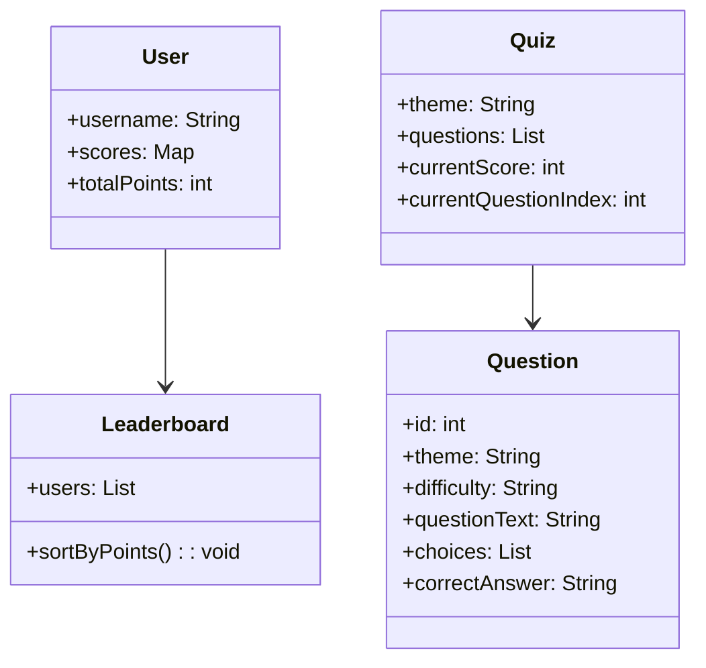
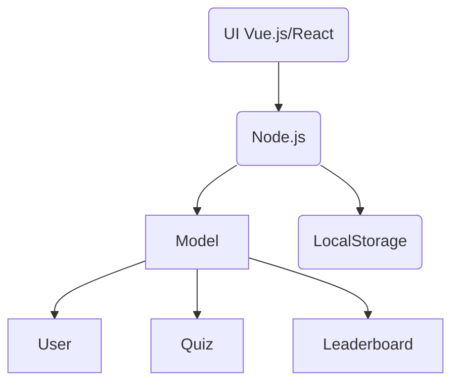
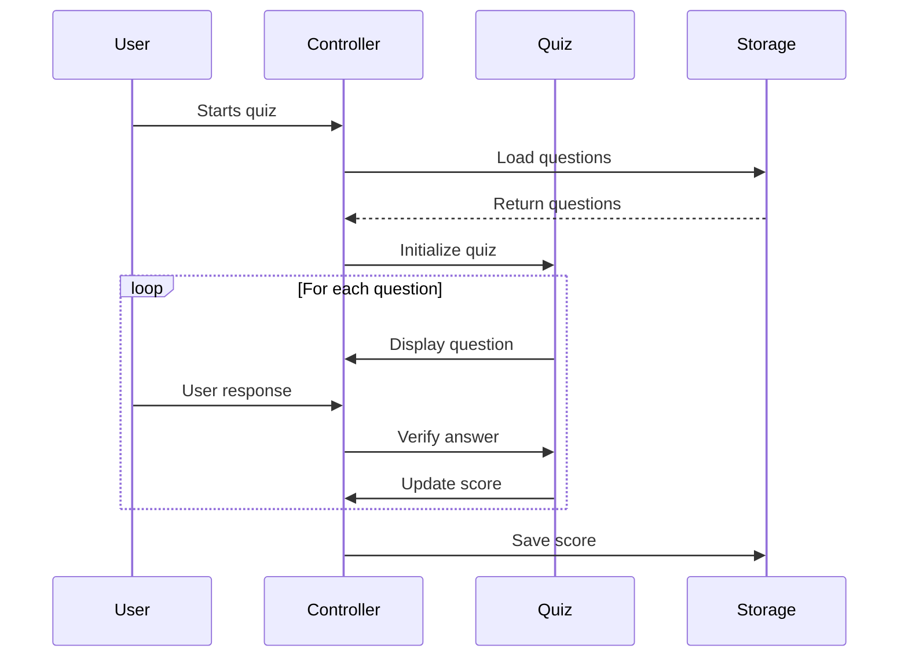

# Formula one Quiz full generative ai (MAGIC Pattern)


## Getting Started

1. Run `npm install`
2. Run `npm run dev`


## Project Overview

Ce projet implique la création d'une application web interactive de quiz à choix multiples centrée sur la Formule 1. L'application distingue deux modes d'utilisation - « Grand public » et « Passionnés » - et comprend une gestion simplifiée du profil de l'utilisateur, des statistiques détaillées sur les performances et un tableau de classement local.

## Initial Prompt Creation

je dois faire un résumé de ma demarche de création d'une application web sur la f1 sur mon github pour mon cours de générative ia.
Je vais te donner les étape etc et je veux que tu le mette en mark down pour mon readme.

### Clarification and Spécification

Les précisions suivantes ont été fournies pour clarifier les exigences du projet :

* **Complexity**: Création basique de profils avec noms d'utilisateur, système de score et classement local.
* **Fonctionnalités**:  Quiz par thèmes (Pilotes, Circuits, Règles, Général), suivi individuel des scores.
* **Technologies**: Orienté JavaScript, spécifiquement TypeScript.
* **Architecture**: MVC (Model-View-Controller).
* **Public cible**: Deux modes - Grand public (questions accessibles) et Passionnés (questions techniques).

## Prompt final généré pour Magi Pattern

### General Objective

Create an interactive Formula 1 quiz application targeting two distinct user groups—General Audience and Enthusiasts—with simplified user management, theme-based quizzes, performance tracking, and a local leaderboard.

### Personas

* **Casual User (General Audience)**: Basic knowledge.
* **Expert User (Enthusiasts)**: Technical and detailed knowledge.

### Application Features

* MVC architectural pattern.
* Two distinct user modes (General and Enthusiasts).
* User management, score saving, and local leaderboard.
* Performance tracking by quiz theme.

### Themes

* Drivers
* Circuits
* Rules
* General Quiz (mixed questions)

### Expected Deliverables

#### 1. Class Diagram (Mermaid)



#### 2. Component Diagram (Mermaid)



#### 3. Sequence Diagram (Mermaid)



#### 4. Use Case Diagram (Mermaid)

```mermaid
useCaseDiagram
    actor GeneralAudienceUser
    actor EnthusiastUser
    rectangle Application {
        GeneralAudienceUser --> (Take simple quiz)
        EnthusiastUser --> (Take technical quiz)
        (Take simple quiz) --> (View scores and leaderboard)
        (Take technical quiz) --> (View scores and leaderboard)
        GeneralAudienceUser --> (Select theme)
        EnthusiastUser --> (Select theme)
    }
```

### MVC Software Architecture

* **Model**: Manages user data, quizzes, scores.
* **View**: Interactive and responsive UI.
* **Controller**: Application logic, user interaction handling.

### Technologies Recommended

* **Frontend**: React.js/Vue.js
* **Backend**: Node.js
* **Storage**: LocalStorage

### Initial File Structure

```
F1QuizApp/
├── backend/
│   ├── controllers/
│   │   └── quizController.js
│   ├── models/
│   │   └── quizModel.js
│   └── index.js
├── frontend/
│   ├── components/
│   │   ├── Quiz.vue (or Quiz.jsx)
│   │   ├── UserProfile.vue
│   │   └── Leaderboard.vue
│   ├── views/
│   │   ├── Home.vue
│   │   └── QuizPage.vue
│   ├── App.vue
│   └── main.js
└── README.md
```

### Justification

* **Mermaid**: Simplified visualization and integration.
* **MVC**: Clear separation of concerns.
* **JavaScript Stack**: Accessible, performant, active community.
* **LocalStorage**: Simple and effective for lightweight applications.


